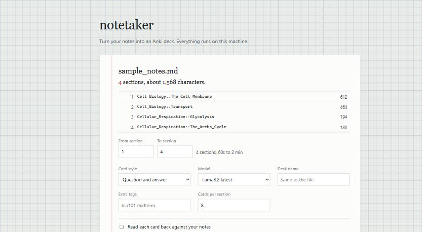
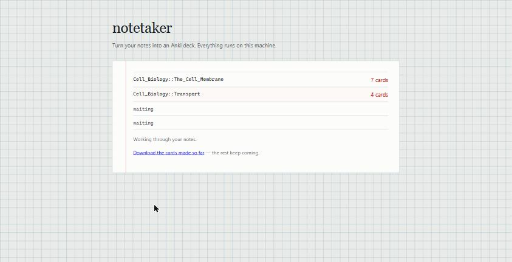
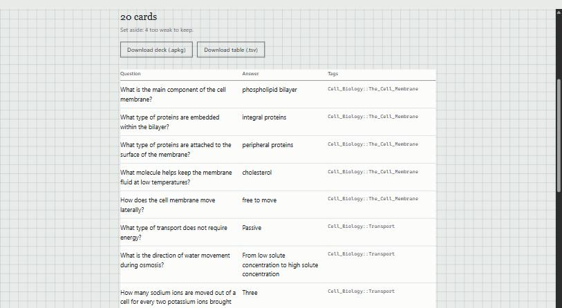

# notetaker (work in progress)

Point it at your notes, get back an Anki deck. It runs a local model through
[Ollama](https://ollama.com), so nothing you feed it leaves your computer.

It works and it's being used, but it's still being changed. Card quality varies
with the model and the notes, defaults move around as more real material gets
tested against it, and the [things still to do](#still-to-do) at the bottom are
real rather than aspirational.

Writing flashcards is the most tedious part of studying, and most of it isn't
really thinking. You read a paragraph, pull out the three things worth
remembering, and type them into two boxes. A small model can do that part.



## Getting started

On Windows, without using a terminal:

1. Install [Python](https://www.python.org/downloads/), ticking
   **Add python.exe to PATH** during setup.
2. Install [Ollama](https://ollama.com/download).
3. Double-click **setup.bat**. It installs everything and downloads the model,
   which is about 5 GB, so it takes a while. This is a one-time thing.
4. Double-click **start-notetaker.bat** whenever you want to make cards. Your
   browser opens by itself. Closing the black window stops it.

Anywhere else, or if you'd rather do it yourself:

```console
$ ollama pull llama3.1:8b
$ pip install -e ".[web]"
$ notetaker serve
```

Either way you end up on the same page. Drop a file on it and go. Markdown,
plain text and PDFs all work.

Dropping a file doesn't start anything. It reads your notes, splits them at
your headings, and tells you what it found: how many sections, what they're
called, and how long making cards from them would take. One real set of lecture
slides came out at 497 sections and roughly four hours, which is worth knowing
before starting rather than after.

Then you pick how much of it you want. All of it, or sections 10 to 40 if you
only care about one lecture.

### Watching it work

Every section is listed up front and fills in as the model finishes with it.



At the end you get the cards in a table, each with a tick box. Untick anything
that looks wrong before downloading, which is the quickest answer to a model
that is right most of the time but not all of it.

Double-click the `.apkg` and Anki takes care of the rest. The `.tsv` is for when
you'd rather look things over in a spreadsheet first.



Your headings become Anki tags, so `## Transport` under `# Cell Biology` comes
out as `Cell_Biology::Transport` and the deck keeps whatever structure your
notes already had.

## From the terminal

Everything works from the command line too:

```console
$ notetaker cards notes/bio-ch3.md
$ notetaker cards lectures.pdf --sections 10-40 --check --deck "Bio::Week 3"
$ notetaker inspect lectures.pdf            # what's in there, without running anything
```

```
  --model TEXT       Ollama model tag          [default: llama3.1:8b]
  --style TEXT       basic or cloze            [default: basic]
  --sections RANGE   10-40, 10-, -3, or 12
  --check            Read each card back against your notes
  --deck TEXT        Anki deck name
  --tag TEXT         Extra tag, repeatable
  --max-cards INT    Cards per section         [default: 8]
  --ocr              Read a scanned PDF with a vision model
  --out, -o PATH     Where to write            [default: out]
```

The page has all of these except a few tuning knobs (`--num-ctx`, `--timeout`,
`--chunk-chars` is there as "section size"). `notetaker cards --help` lists the
rest.

## Which model

The default is `llama3.1:8b`. A 3B model is three times faster and produces
noticeably worse cards on real lecture notes, so the extra wait is worth it if
the machine can take it. `--model llama3.2` if it can't.

What does not help is going further up. Bigger is not reliably better at this,
because pulling facts out of a paragraph isn't a reasoning problem.

| Model | Per call | Notes |
| --- | --- | --- |
| `llama3.1:8b` | ~40s | The default. Better cards, worth the wait. |
| `llama3.2` (3B) | ~13s | Much faster, noticeably rougher cards |
| `phi4-mini:3.8b` | ~20s | Fine, but writes compound questions |
| `qwen3.5`, `deepseek-r1` | 280s+ | Don't |

Reasoning models are the trap. `qwen3.5:9b` spent over four minutes on a single
four-sentence section with the model already loaded. Passing `think: false`
makes it faster and also makes it stop honouring the JSON schema, so notetaker
never sends it and just warns you when you pick one.

More detail and actual numbers in [docs/model-notes.md](docs/model-notes.md).

## Cards it throws away

Duplicates go, including the annoying kind where the same fact is asked from
both directions. So does anything you could guess: yes/no questions, questions
asking two things at once, answers that are a paragraph.

Course admin goes too. Lecture decks are full of slides about exam dates,
office hours and how engagement points are awarded, and a model handed one of
those will cheerfully write "When is Exam 1 scheduled? -> Thursday, February
19th". Sections headed Logistics, Announcements, Syllabus and the like are
skipped without asking the model at all, and admin questions that come from a
slide with an innocent heading are dropped afterwards.

Everything dropped is written to a `.dropped.tsv` file with the reason, and
shown on the page, so you can check the filters aren't eating things they
shouldn't.

That last bit is enforced in code rather than in the prompt, because asking
politely didn't work. The prompt tells the model not to write yes/no questions,
with an example, and `llama3.2` wrote four of them anyway in a four-section
document.

## Checking cards against your notes

Tick "read each card back against your notes", or pass `--check`. Every card
gets read back against the section it came from, and the ones the passage
doesn't support are dropped.

The failure that actually hurts isn't an ugly card, it's a confident wrong one.
From a nearly empty slide, `llama3.2` produced:

> Which sex chromosome determines male characteristics? → X

It's the Y chromosome. The card looks fine, so no rule about its shape will
catch it. What catches it is that the slide never said it. Asked whether the
passage supports the card, and made to quote the words, the same model throws
it out.

It doesn't check facts, though. If your notes are wrong, a card faithfully
repeating them sails through. And it's the same model doing the checking, so
it's a filter rather than a guarantee. If the model can't be reached, every card
is kept — a broken checker emptying your deck would be worse than no checker.
Costs about 70% more time, so it's off unless you ask.

## PDFs

PDFs don't have headings in any structural sense, but they usually have them
visually — a short line on its own above a paragraph — and those get recovered
and used for tags.

Three things came out of feeding it real lecture slides. Text is extracted in
layout mode, because the default drops the blank lines between paragraphs and a
whole page arrives as one run-on block. Anything printed on lots of pages is
stripped first: one deck had the lecturer's name on every slide, which looked
exactly like a heading, and 93 sections ended up tagged with it. And some
PDFs have rotated text that can't be read at all, so it reports how many pages
are affected.

If there's no text layer, the page offers to read the pictures with a vision
model (`--ocr` from the terminal). Two warnings. It needs the model to fit in
your graphics card's memory; on a machine where it didn't, a single page took
over four minutes. And a vision model that misreads gives you a plausible wrong
word rather than obvious nonsense, which is worse when you're about to memorise
it.

## Development

```console
$ pip install -e ".[dev,web,ocr]"
$ pytest                  # all offline, no Ollama needed
$ ruff check . && ruff format --check .
```

The suite runs without Ollama because everything talks to a small `LLMClient`
protocol, so tests use stubs and a mocked HTTP transport. The few that need a
live model are marked `integration` and CI never runs them.

There's also `scripts/compare_models.py`, which runs the same notes through
several models and prints the cards so you can judge them yourself.

## Still to do

- The checker drops about a third of cards, and whether that is correct or too
  eager has not been measured
- Cards can be dropped before downloading, but not edited

## License

MIT. See [LICENSE](LICENSE).
