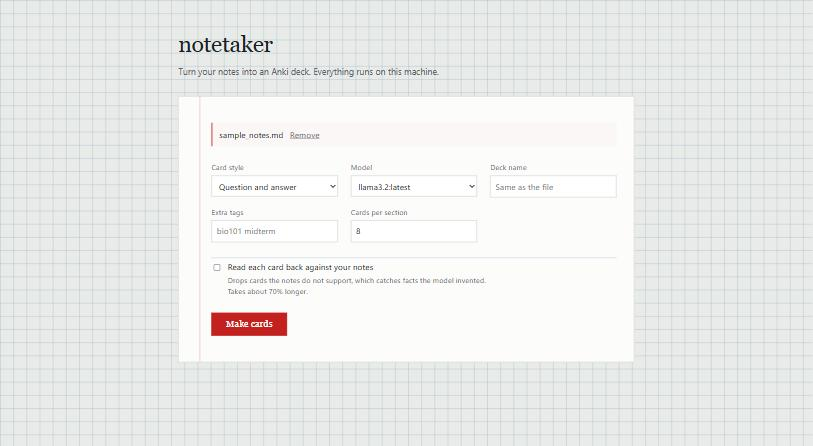

# notetaker

Point it at your notes, get back an Anki deck. It runs a local model through
[Ollama](https://ollama.com), so nothing you feed it leaves your computer.

I made this because writing flashcards is the worst part of studying and most
of it isn't really thinking. You read a paragraph, you pull out the three
things worth remembering, you type them into two boxes. A small model can do
that part.



## Getting it running

You'll need Python 3.11 or newer and Ollama with a model pulled:

```console
$ ollama pull llama3.2
$ pip install -e .
$ notetaker cards notes/bio-ch3.md
```

That's it. There's a `--llm fake` mode too, which doesn't use a model at all —
it's a crude sentence matcher I wrote so the tests could run without Ollama,
but it's also handy if you just want to see what the output looks like before
downloading a few gigabytes.

A run looks like this:

```console
$ notetaker cards examples/sample_notes.md

  reading   examples/sample_notes.md  (4 sections, 1568 chars)
  model     ollama/llama3.2
  style     basic
  estimate  roughly 60s to 2 min

  [1/4] Cell_Biology::The_Cell_Membrane  ->  5 cards
  [2/4] Cell_Biology::Transport  ->  4 cards
  [3/4] Cellular_Respiration::Glycolysis  ->  6 cards
  [4/4] Cellular_Respiration::The_Krebs_Cycle  ->  5 cards

  generated 20 cards  (4 low-quality dropped)

  out/sample_notes.apkg   double-click to import
  out/sample_notes.tsv    or use File > Import
```

You get two files. Double-click the `.apkg` and Anki does the rest. The `.tsv`
is for when you'd rather look the cards over in a spreadsheet first, which I
end up doing more often than not.

Your markdown headings turn into Anki tags, so `## Transport` under
`# Cell Biology` becomes `Cell_Biology::Transport` and your deck keeps whatever
structure your notes already had.

## Options

```
notetaker cards NOTES [OPTIONS]        # NOTES is .md, .txt or .pdf

  --out, -o PATH     Where to write            [default: out]
  --model TEXT       Ollama model tag          [default: llama3.2]
  --style TEXT       basic or cloze            [default: basic]
  --sections RANGE   Which sections to use, e.g. 10-40, 10-, -3, 12
  --check            Read each card back against your notes
  --deck TEXT        Anki deck name            [default: the file name]
  --tag TEXT         Extra tag, repeatable
  --max-cards INT    Cards per section         [default: 8]
  --chunk-chars INT  Notes per model call      [default: 4000]
  --llm TEXT         ollama or fake            [default: ollama]
```

If you'd rather not think about flags, `pip install -e ".[web]"` and then
`notetaker serve` gives you a page to drop a file onto.

## Looking before you leap

Long documents take a while, so there's a command that tells you what you're in
for without calling a model at all:

```console
$ notetaker inspect lectures/neuro301.md

  reading   lectures/neuro301.md  (9 sections, 11,595 chars)

  [  1] Neuroscience_301                                 54 chars
  [  2] Neuroscience_301::Resting_Potential           1,678 chars
  [  3] Neuroscience_301::Action_Potentials             537 chars
  ...

  largest   2,492 chars
  estimate  roughly 2 min to 5 min to generate
            roughly 4 min to 9 min with --check
```

Those section numbers are what `--sections` takes, so you can work through
something big a lecture at a time:

```console
$ notetaker cards lectures.pdf --sections -3        # a first look
$ notetaker cards lectures.pdf --sections 10-40     # one lecture
$ notetaker cards lectures.pdf --sections 41-       # the rest
```

Each range writes its own files (`lectures.10-40.apkg`) so runs don't overwrite
each other, and every run ends by telling you the range to ask for next. I added
this after pointing it at a 500-section slide deck and realising a single run
would take about five hours.

## Watching it work

The web page shows every section up front and fills them in as the model
finishes with them. A spinner would tell you nothing, and these runs are slow
enough that you want to see something happening.


When it's done you get the cards in a table and two download buttons.


## Which model

This surprised me: bigger is worse here. Pulling facts out of a paragraph isn't
a reasoning problem, and a 3B instruct model does it about as well as a 7B one
and several times faster.

| Model | Per call | Notes |
| --- | --- | --- |
| `llama3.2` (3B) | ~13s | Best of the lot. The default. |
| `llama3.1:8b` | ~40s | Slightly better coverage, writes list answers |
| `phi4-mini:3.8b` | ~20s | Fine, but writes compound questions |
| `qwen3.5`, `deepseek-r1` | 280s+ | Don't |

Reasoning models are the trap. `qwen3.5:9b` spent over four minutes on a single
four-sentence section with the model already loaded, which works out at about an
hour for a normal set of notes. The obvious fix, passing `think: false`, makes
it stop honouring the JSON schema entirely and reply in markdown instead. So
notetaker never sends `think` and just warns you when you pick one of these.

Longer version with actual numbers in [docs/model-notes.md](docs/model-notes.md).

## Cards it throws away

Duplicates go, including the annoying kind where the same fact is asked from
both directions. So does anything you could guess: yes/no questions, questions
asking two things at once, answers that are a paragraph.

That last bit is enforced in code rather than in the prompt, because asking
politely didn't work. The prompt tells the model not to write yes/no questions,
with an example, and `llama3.2` wrote four of them anyway in a four-section
document. Small models are bad at being told not to do things.

## Checking cards against your notes

```console
$ notetaker cards notes.pdf --check
```

This reads every card back against the section it came from and drops the ones
the passage doesn't support.

It's worth it because the failure that actually hurts isn't an ugly card, it's a
confident wrong one. From a nearly empty slide, `llama3.2` gave me:

> Which sex chromosome determines male characteristics? → X

It's the Y chromosome. The card looks perfectly fine, so no rule about its shape
will ever catch it. What catches it is that the slide never said it — the model
filled an empty slide from memory. Ask the same model whether the passage
supports the card and make it quote the words, and it throws it out.

Worth being clear about what this isn't. It doesn't check facts. If your notes
are wrong, a card faithfully repeating them sails through. And it's the same
model doing the checking, so it's a filter, not a guarantee.

If the model is unreachable or answers with nonsense, every card is kept. A
broken checker emptying your deck would be much worse than no checker. It costs
about 70% more time (170s against 282s over the same three sections), so it's
off unless you ask for it.

## PDFs

`.md`, `.txt` and `.pdf` all work. PDFs don't have headings in any structural
sense, but they usually have them visually — a short line sitting on its own
above a paragraph — and those get recovered and used for tags.

A few things I learned the hard way feeding it real lecture slides:

Text gets extracted in layout mode, because the default drops the blank lines
between paragraphs and a whole page arrives as one run-on block.

Anything printed on lots of pages gets stripped before headings are worked out.
My slides had the lecturer's name on every one, which is short and unpunctuated
with prose underneath, so it looked exactly like a heading and 93 sections ended
up tagged `Dr_Sollars`.

Some PDFs have rotated text that pypdf can't read. It'll tell you how many pages
are affected, because it means those cards are missing content.

### Scans

If there's no text layer at all, `--ocr` renders each page and reads it with a
local vision model. Fair warning on two counts. It needs the model to fit in
your GPU's memory — on mine it didn't, Ollama put it on the CPU, and a single
page took over four minutes. Run `ollama ps` and look at `size_vram`; if it's 0,
go make a coffee. And a vision model that misreads gives you a plausible wrong
word rather than obvious garbage, which is worse when you're going to memorise
it.

## Development

```console
$ pip install -e ".[dev,web,ocr]"
$ pytest                  # all offline, no Ollama needed
$ pytest -m integration   # these hit a real model
$ ruff check . && ruff format --check .
```

The whole suite runs without Ollama because everything talks to a small
`LLMClient` protocol, so the tests use stubs and a mocked HTTP transport. Only
the integration-marked ones need a live model, and CI never runs those.

There's also `scripts/compare_models.py`, which runs the same notes through
several models and prints the cards so you can judge them yourself:

```console
$ python scripts/compare_models.py --models llama3.2 llama3.1:8b --show-cards
```

## Still to do

- The checker's rejection rate looks high (about a third) and I haven't
  properly worked out whether that's correct or too eager
- `inspect` only lists the first 30 sections, which makes finding a range in
  the middle of a long document awkward
- Rejected cards are counted but not written anywhere, so you can't review them

## License

MIT. See [LICENSE](LICENSE).
